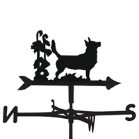

<p align="center">
    
</p>

# The multi-process server for _shelf_ <br> [](https://travis-ci.org/katzer/mruby-heeler) [](https://ci.appveyor.com/project/katzer/mruby-heeler/branch/master) [](https://codebeat.co/projects/github-com-katzer-mruby-heeler-master)

Heeler is a [shelf][shelf]-compatible webserver that can be used as a drop-in replacement instead of [mruby-simplehttpserver][simplehttpserver].

The server handles every request within a newly forked process. It also works well for Windows, however not in a multi-process mode.

If your app is based on [Yeah!][yeah], then the heeler webserver is used by default.

## Usage

The mgem provides with an integrated [shelf][shelf] handler:

```ruby
app = Shelf::Builder.new
app.run ->(_) { [200, {}, ['<h1>Yeah!</h1>']] }

server = Shelf::Server.new server: 'heeler', app: app
server.start
```

Or define `SHELF_HANDLER` before you start your shelf app:

    $ SHELF_HANDLER=heeler shelf-app

## Installation

Add the line below to your `build_config.rb`:

```ruby
MRuby::Build.new do |conf|
  # ... (snip) ...
  conf.gem 'mruby-heeler'
end
```

Or add this line to your aplication's `mrbgem.rake`:

```ruby
MRuby::Gem::Specification.new('your-mrbgem') do |spec|
  # ... (snip) ...
  spec.add_dependency 'mruby-heeler'
end
```

## Development

Clone the repo:
    
    $ git clone https://github.com/katzer/mruby-heeler.git && cd mruby-heeler/

Compile the source:

    $ rake compile

Run the tests:

    $ rake test

## Contributing

Bug reports and pull requests are welcome on GitHub at https://github.com/katzer/mruby-heeler.

1. Fork it
2. Create your feature branch (`git checkout -b my-new-feature`)
3. Commit your changes (`git commit -am 'Add some feature'`)
4. Push to the branch (`git push origin my-new-feature`)
5. Create new Pull Request

## Authors

- Sebastián Katzer, Fa. appPlant GmbH

## License

The mgem is available as open source under the terms of the [MIT License][license].

Made with :yum: from Leipzig

© 2018 [appPlant GmbH][appplant]

[shelf]: https://github.com/katzer/mruby-shelf
[yeah]: https://github.com/katzer/mruby-yeah
[simplehttpserver]: https://github.com/matsumotory/mruby-simplehttpserver
[license]: http://opensource.org/licenses/MIT
[appplant]: www.appplant.de
